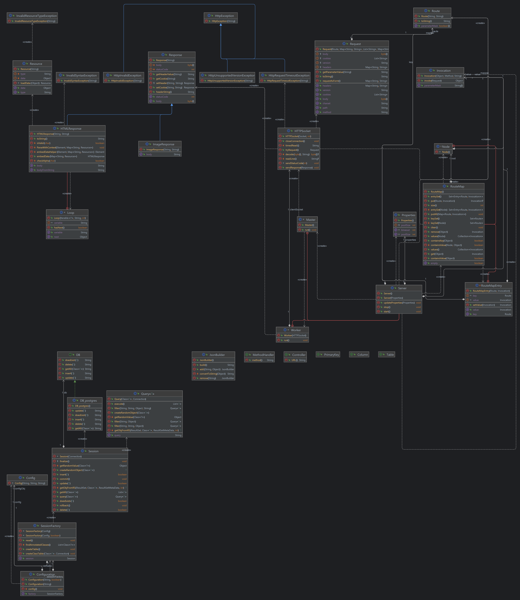
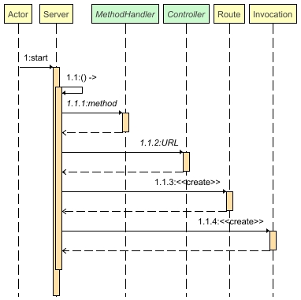
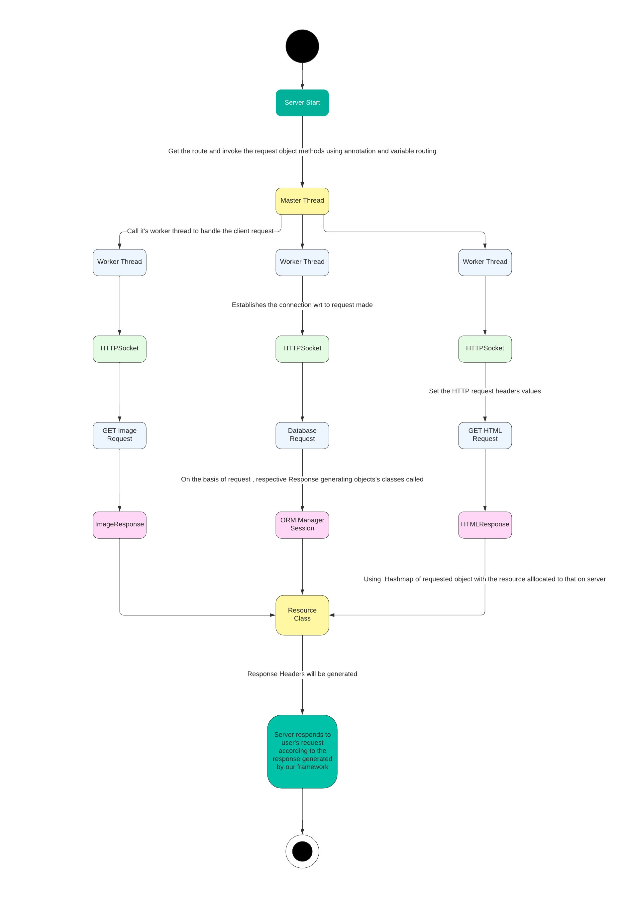

# Design Document

---
## 1. Introduction

---
### 1.1 Description of the project

The project aims to design a server-based web application framework. Our focus is on developing a robust framework that enables the creation of web applications with ease. It will provide the necessary tools and components for server-side development. The framework will simplify the process of building web applications and empower developers to create server-based solutions efficiently. We have also made our own ORM which is compatible with postgres. With the ORM package, Users can quickly create classes which map to database in postgres. User can delete ,insert and update objects. Users can create queries.

### 1.2 Aim of the project

The purpose of this project is to gain a comprehensive understanding of two widely used frameworks, Flask and Spring Boot, and their respective design and working principles. By studying and implementing these frameworks, we aim to enhance our knowledge and expertise in developing web applications. Flask, a Python-based microframework, offers a lightweight and flexible approach for building web applications. On the other hand, Spring Boot, a Java-based framework, provides a powerful and quick framework for developing enterprise-grade applications. Through this project, we explored the core concepts, architectural patterns, and features of these frameworks, enabling us to leverage their capabilities and apply them effectively in our own software development projects.

### 1.3 Working of the project

The working of our server-based web application framework revolves around simplifying the development process and empowering developers to create efficient server-based solutions. The framework provides a set of tools and components for server-side development, allowing developers to focus on application logic rather than low-level implementation details.

The core functionality that our framework provides is easy access to a thread-pool based TCP server following the HTTP/1.1 protocol as defined by <a href="https://www.rfc-editor.org/rfc/rfc2616">RFC</a>, via the Server, Request and Response classes. The server will wait for valid HTTP/1.1 connections and serve various clients.

Our Request and Response classes makes HTTP request processing easier for the developer while still maintaining his freedom to do whatever he wants. Using advanced Java concepts like Reflection coding and Annotation Processing, the user can quickly spin up routing solutions as per his needs.

Another componenent which is closely related to ease of framework is the templating solution provided by the extension of Response class (HTMLResponse). Templating can allow developers to make the html dynamic, by giving features like for-loops, dynamic attributing and contextual variables.

Another key features of our framework is the custom Object-Relational Mapping (ORM) package. This ORM is specifically designed to be compatible with the PostgreSQL database. With this package, developers can easily create classes that map to database tables in PostgreSQL. This mapping simplifies the process of working with data and performing CRUD operations (Create, Read, Update, Delete) on objects.

Using our framework's ORM package, developers can quickly and seamlessly interact with the database. They can insert, update, and delete objects without writing complex SQL queries manually. The framework abstracts away the underlying database operations, allowing developers to focus on the application's business logic.

Additionally, the framework provides a query builder that allows users to create complex queries using a simplified syntax. This enables developers to retrieve data from the database efficiently, filter results, and perform advanced data manipulations.

Overall, our framework streamlines the development of server-based web applications by providing a robust set of tools and a custom ORM package compatible with PostgreSQL. Developers can leverage these features to create, manage, and manipulate data with ease, enabling them to build efficient and scalable applications.

## 2. General Description

---
### 2.1 Product Perspective

From a product perspective, our project aims to deliver a user-friendly and efficient server-based web application framework. It provides developers with essential tools and components to simplify the development process and improve productivity. The custom ORM package, designed for compatibility with PostgreSQL, streamlines database operations, allowing for seamless data manipulation. The query builder facilitates the creation of complex queries, enhancing flexibility and efficiency.

The framework prioritizes end-user satisfaction by ensuring optimized performance and scalability. This results in faster response times and a superior user experience. Additionally, the framework's adherence to best practices, conventions, and comprehensive documentation ensures ease of learning, implementation, and maintenance.

### 2.2 Tools Used

- Lucid Chart:  Lucid chart a Web-based UML design program, is used to generate all the diagrams used in the analysis and design phases of the project.
- PostgreSQL: PostgreSQL is a powerful, open source object-relational database system with over 30 years of active development that has earned it a strong reputation for reliability, feature robustness, and performance.
- Jsoup: It is a Java based library to work with HTML based content. It provides a very convenient API to extract and manipulate data, using the best of DOM, CSS, and jquery-like methods. It implements the WHATWG HTML5 specification, and parses HTML to the same DOM as modern browsers do.
- JUnit: It is an open source framework, which is used for writing and running tests. Provides annotations to identify test methods. Provides assertions for testing expected results. Provides test runners for running tests.
- Classgraph: It is an opensource library to quickly discover and load classes dynamically. It enables developers to scan the classpath and explore the structure of classes at runtime. We used it find all the annotated classes.

## 3. API DOCUMENTATION
1. To see the ORM API's documentation navigate to the

   - [index.html](./ORM/Documentation/index.html)

2. To see the Server API's documentation navigate to the 

   - [index.html](./Server/index.html)

## 4. Diagrams

**Below are detailed class diagrams of the project:**

### 4.1 UML Diagram

### 4.2 Sequence Diagram

### 4.3 Data Flow Diagram

##  Thanks!

